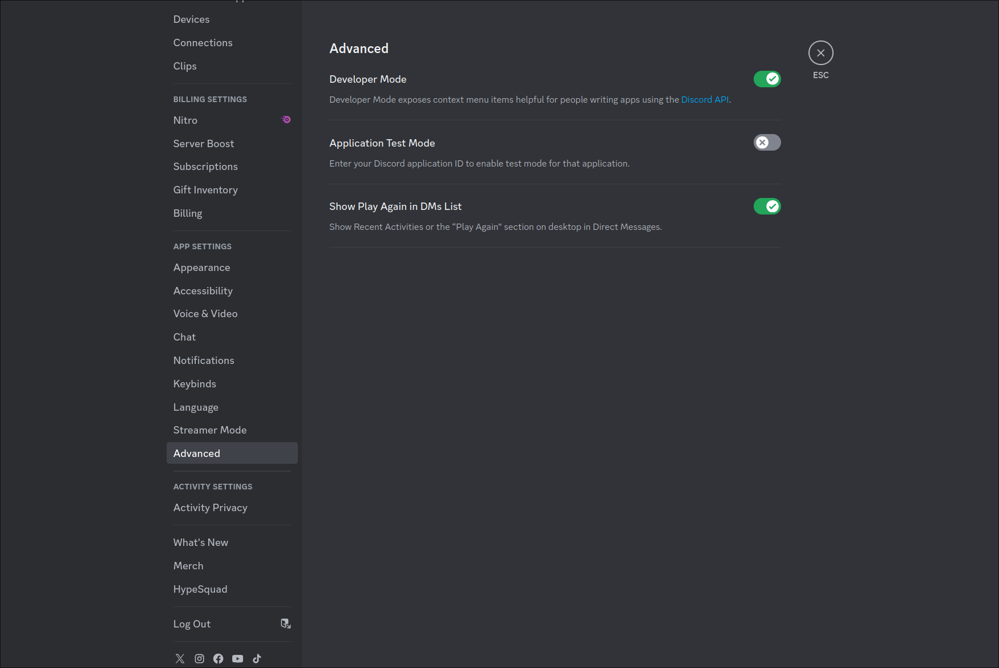
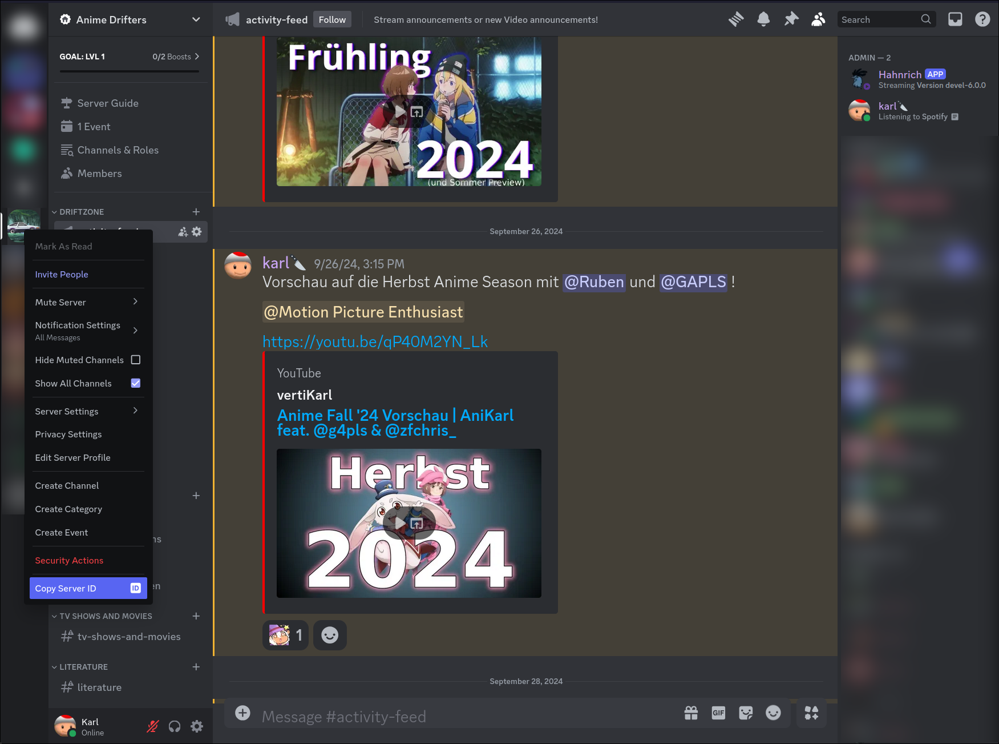
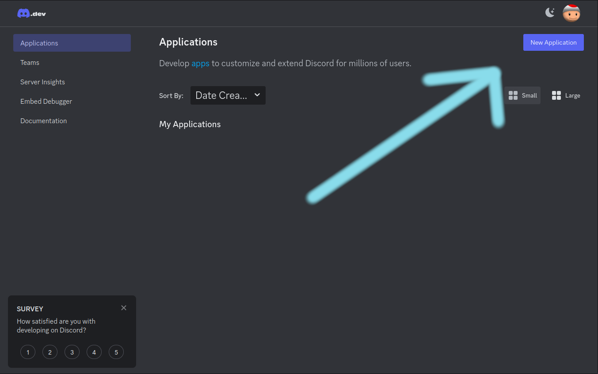
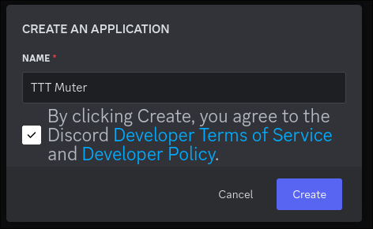
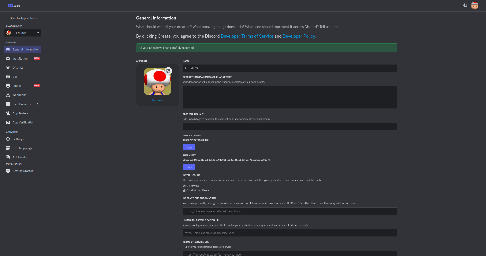
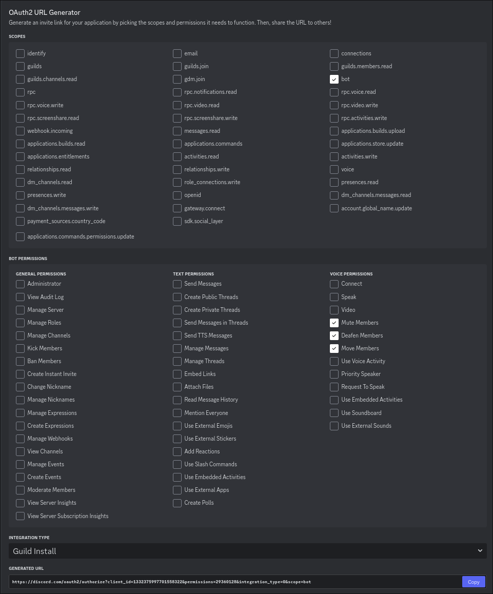

{}

### Downloading

Head over to https://github.com/Discord-for-TTT2/dttt-backend/releases
and grab the latest release (the one with the highest version number).

### Extracting

Now unzip it on your target machine (the pc you want the bot to run on).
This can very well be the same server your TTT2 instance runs on.
Just make sure to grab the ip address/FQDN of the machine you are running your bot on.

### Installing node.js

If you haven't already, now is the time to install node.js on the pc that will run the bot.
If you are on

- Windows, head over to https://nodejs.org/en/download and follow the instructions.
- Linux, install it from your favorite package manager.

### Generating empty config file

As I am still not sure if I should always provide a default config.json with the zip, we'll have to start the bot once for it to auto-generate.

To do so, simply run: `node index.js` in the directory containing the extracted bot files.
Or if you are on Linux you can also just run `./start.sh`

This should generate you a config.json file that you can edit!

### Filling the config file

Open the config.json with your favorite text editor and fill it with the following information

#### DTTT_API_KEY

This is the api key you will use to communicate between DTTT and this bot.
So fill it out with whatever, just make sure to use the same content in Garry's Mod!

#### GUILD_ID

This is the ID of the Discord server your TTT sessions will be hosted at.  
To get it you need to turn on "Developer Mode" in your Discord settings.

Then just right-click on your Discord server icon and click "Copy Server ID".

#### PORT

This is the port your bot will run on. If you don't know what that means, leave it as it is.

#### DISCORD_TOKEN

For this you now need to register an application on the [Discord Developer Portal](https://discord.com/developers/applications).

Head over to https://discord.com/developers/applications

Click on "new Application" and give it a name, for example "TTT Muter".

Now you can optionally give it a profile image.

Then head over to **OAuth2** on the bar on the left.
On the **OAuth2** page, scroll down and generate a URL with (at least) the following permissions set

Open the URL in your browser and add the bot to your Discord server.

Now switch to the bot tab on the left and click on "Reset Token".
This will (if set up) trigger a 2FA check from Discord, enter your code and confirm.
It will then display a token that you can copy into your config.json as the DISCORD_TOKEN.

#### ENABLE_LEGACY_BACKEND

This enables support for another addon called [discord_muter](https://github.com/Nekkusu3/discord_muter)
It is the addon we previously used on our Discord and which inspired us to build our own, more enhanced version DTTT!

Available here: https://steamcommunity.com/sharedfiles/filedetails/?id=3269025256

Do not use DTTT **AND** discord_muter at the same time, as this **WILL** break things.

Though you can leave the legacy backend enabled, as it does not conflict with anything. Just make sure you don't have DTTT and discord_muter installed at the same time.


{}
